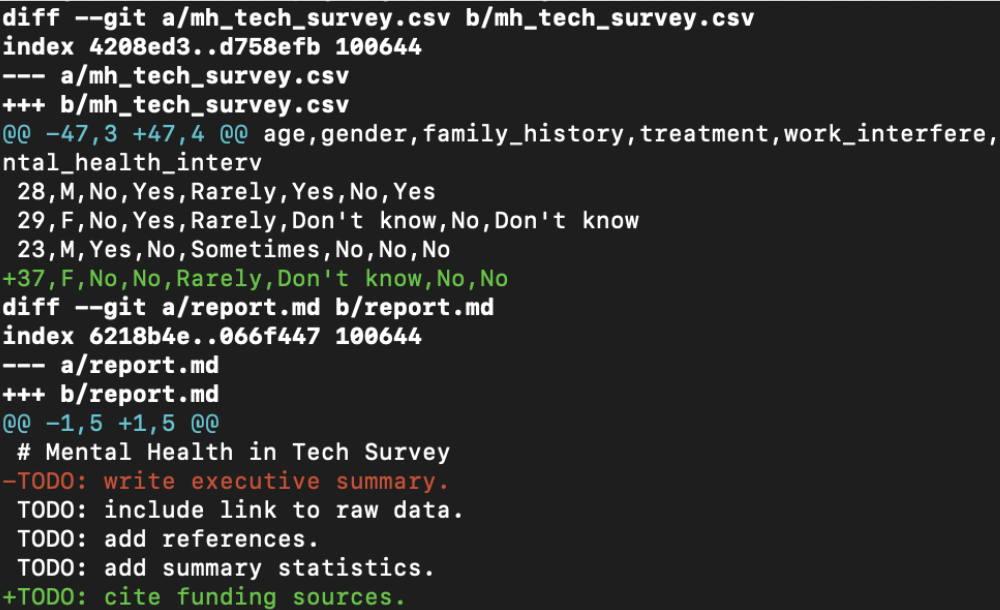

# Cómo ver las diferencias entre *commits*

## `git diff`

El comando `git diff` se utiliza para mostrar las diferencias entre diferentes puntos de control en un repositorio de Git. Puede mostrar las diferencias entre:

- Los cambios realizados pero aún no agregados al área de preparación.
- Los cambios agregados al área de preparación pero aún no confirmados.
- Los cambios entre dos *commits*, ramas o etiquetas específicos.

### Uso básico:

```bash
git diff
```

Este comando mostrará las diferencias entre los cambios realizados en los archivos que aún no se han agregado al área de preparación. Te mostrará las líneas que han sido modificadas, agregadas o eliminadas.

### Diferencias entre los cambios preparados:

```bash
git diff --staged
```

Con esta opción, `--staged` o `--cached`, podrás ver las diferencias entre los cambios que ya has agregado al área de preparación y aún no se han confirmado.

### Diferencias entre *commits*, ramas o etiquetas:

```bash
git diff commit1 commit2
```

Reemplaza `commit1` y `commit2` con los identificadores de los commits, nombres de las ramas o etiquetas entre los que deseas ver las diferencias. Esto te mostrará las modificaciones realizadas entre esos dos puntos de control.

### Diferencias en un archivo específico:

```bash
git diff archivo.txt
```

Si solo quieres ver las diferencias en un archivo específico, puedes proporcionar el nombre del archivo después del comando `git diff`. Esto mostrará las modificaciones realizadas en ese archivo en comparación con la versión anterior.

## Cómo leer la salida de `git diff`

La salida del comando `git diff` puede presentar información detallada sobre las diferencias entre archivos o puntos de control en tu repositorio de Git. Aquí hay algunos elementos clave que puedes encontrar en la salida y cómo leerlos:

### Encabezado de archivo: 

```bash
diff --git a/archivo.txt b/archivo.txt
```

Este encabezado indica el nombre del archivo que se está mostrando. En este ejemplo, el archivo se llama "archivo.txt". Puede aparecer un encabezado similar para cada archivo modificado en la salida.

### Líneas modificadas:

```bash
- línea eliminada
+ línea agregada
```

Las líneas precedidas por "-" representan líneas eliminadas, mientras que las líneas precedidas por "+" representan líneas agregadas. Estas líneas muestran las diferencias específicas entre las versiones comparadas. También puede haber líneas que no tengan ningún símbolo "+" o "-" para representar líneas que no han sido modificadas.

### Bloque de cambios:

Estos bloques de cambios proporcionan información sobre las secciones modificadas dentro del archivo. El formato es: `@@ -inicio, tamaño +inicio, tamaño @@`. El número antes de la coma representa la línea de inicio del bloque y el número después de la coma indica la cantidad de líneas en el bloque.

¿Puedes leer la siguiente salida de `git diff`?


